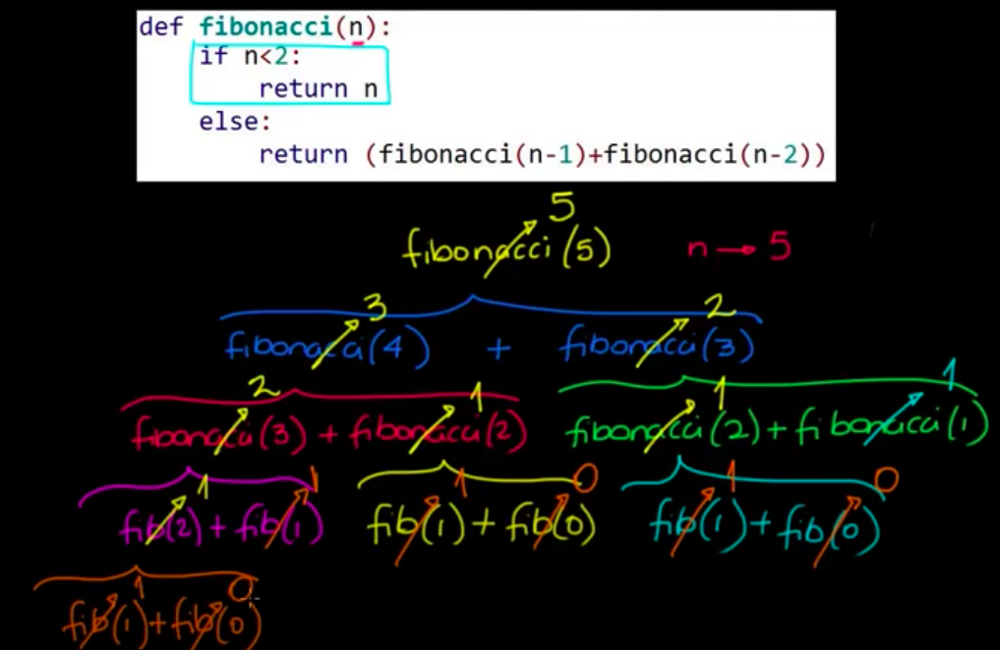

 ## Fibonacci sequence challenge

 Given the following code example:




 Output `print` example for number `3`:

 ```
input n --> 3
input branche (n-1) --> 2 branche (n-2) --> 1
input n --> 2
input branche (n-1) --> 1 branche (n-2) --> 0
input n --> 1
value n --> 1 return -->  1
input n --> 0
value n --> 0 return -->  0
fibonacci(1) + fibonacci(0): 1
input n --> 1
value n--> 1 return -->  1
fibonacci(2) + fibonacci(1): 2


2
 ```

### Get a fibonacci sequence with a `recursive function` for a number given.

Example:

```
Fibonacci sequence for number 5 --> 0, 1, 1, 2, 3, 5

```

Team Lead has given the following tests:

```python
# Driver code

#fibonacci sequence for -1
print(get_fibonacci_seq(-1) == "Incorrect input")

#fibonacci sequence for 1
print(get_fibonacci_seq(1) == [0, 1])
									
#fibonacci sequence for 5
print(get_fibonacci_seq(5) == [0, 1, 1, 2, 3, 5])

#fibonacci sequence for 10
print(get_fibonacci_seq(10) == [0, 1, 1, 2, 3, 5, 8, 13, 21, 34, 55])

```

Constrainsts:

```python


	"""function to get fibonacci sequence"""


	"""function to get fibonacci for a number"""
	


``` 

